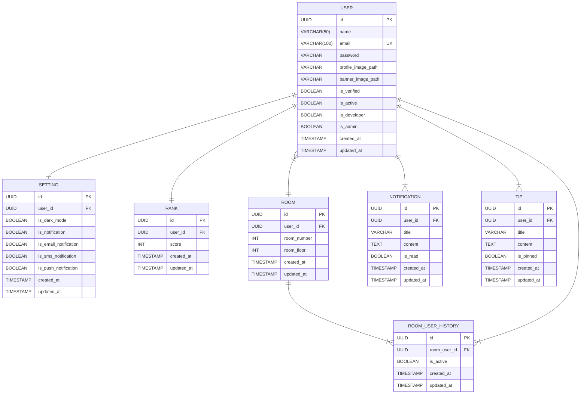

# DATABASE SCHEMA ( Entity Relationship Diagram )

> 이 문서는 Clim-Api-Service 의 데이터베이스 스키마, 이하 ERD(Entity Relationship Diagram)에 대한 설명을 담고 있습니다.

*이 문서는 Entity Relationship Diagram 를 제작할 때 사용하는 툴인 [mermaid](https://mermaid.js.org/) 에서 제공하는 markdown 형식으로 작성되었습니다.

## TABLES
> Clim API Service에서 사용되는 데이터베이스 테이블에 대한 설명입니다.

### USER
- `UUID id` (Primary Key) : 유저를 식별하는 고유 식별자입니다.
- `VARCHAR(50) name` : 유저의 이름을 저장하는 필드입니다.
- `VARCHAR(100) email` (Unique Key) : 유저의 이메일 주소를 저장하는 필드로, 중복되지 않도록 설정되어 있습니다.
- `VARCHAR password` : 유저의 비밀번호를 암호화하여 저장하는 필드입니다.
- `VARCHAR profile_image_path` : 유저의 프로필 이미지 경로를 저장하는 필드입니다.
- `VARCHAR banner_image_path` : 유저의 배너 이미지 경로를 저장하는 필드입니다.
- `BOOLEAN is_verified` : 유저의 이메일 인증 여부를 저장하는 필드입니다.
- `BOOLEAN is_active` : 유저 계정의 활성화 상태를 저장하는 필드입니다.
- `BOOLEAN is_developer` : 유저가 개발자인지 여부를 저장하는 필드입니다.
- `BOOLEAN is_admin` : 유저가 관리자 권한을 가지고 있는지 여부를 저장하는 필드입니다.
- `TIMESTAMP created_at` : 유저 정보가 생성된 시간을 저장하는 필드입니다.
- `TIMESTAMP updated_at` : 유저 정보가 마지막으로 수정된 시간을 저장하는 필드입니다.

### SETTING
- `UUID id` (Primary Key) : 설정을 식별하는 고유 식별자입니다.
- `UUID user_id` (Foreign Key) : 설정이 연결된 유저의 식별자입니다. `USER` 테이블과의 관계를 나타냅니다.
- `BOOLEAN is_dark_mode` : 다크 모드 활성화 여부를 저장하는 필드입니다.
- `BOOLEAN is_notification` : 일반 알림 활성화 여부를 저장하는 필드입니다.
- `BOOLEAN is_email_notification` : 이메일 알림 활성화 여부를 저장하는 필드입니다.
- `BOOLEAN is_sms_notification` : SMS 알림 활성화 여부를 저장하는 필드입니다.
- `BOOLEAN is_push_notification` : 푸시 알림 활성화 여부를 저장하는 필드입니다.
- `TIMESTAMP created_at` : 설정 정보가 생성된 시간을 저장하는 필드입니다.
- `TIMESTAMP updated_at` : 설정 정보가 마지막으로 수정된 시간을 저장하는 필드입니다.

### RANK
- `UUID id` (Primary Key) : 랭크를 식별하는 고유 식별자입니다.
- `UUID user_id` (Foreign Key) : 랭크가 연결된 유저의 식별자입니다. `USER` 테이블과의 관계를 나타냅니다.
- `INT score` : 유저의 랭크 점수를 저장하는 필드입니다.
- `TIMESTAMP created_at` : 랭크 정보가 생성된 시간을 저장하는 필드입니다.
- `TIMESTAMP updated_at` : 랭크 정보가 마지막으로 수정된 시간을 저장하는 필드입니다.

### ROOM
- `UUID id` (Primary Key) : 방을 식별하는 고유 식별자입니다.
- `UUID user_id` (Foreign Key) : 방을 생성한 유저의 식별자입니다. `USER` 테이블과의 관계를 나타냅니다.
- `INT room_number` : 방 번호를 저장하는 필드입니다.
- `INT room_floor` : 방의 층 수를 저장하는 필드입니다.
- `TIMESTAMP created_at` : 방 정보가 생성된 시간을 저장하는 필드입니다.
- `TIMESTAMP updated_at` : 방 정보가 마지막으로 수정된 시간을 저장하는 필드입니다.

### NOTIFICATION
- `UUID id` (Primary Key) : 알림을 식별하는 고유 식별자입니다.
- `UUID user_id` (Foreign Key) : 알림이 연결된 유저의 식별자입니다. `USER` 테이블과의 관계를 나타냅니다.
- `VARCHAR title` : 알림의 제목을 저장하는 필드입니다.
- `TEXT content` : 알림의 내용을 저장하는 필드입니다.
- `BOOLEAN is_read` : 알림이 읽혔는지 여부를 저장하는 필드입니다.
- `TIMESTAMP created_at` : 알림이 생성된 시간을 저장하는 필드입니다.
- `TIMESTAMP updated_at` : 알림이 마지막으로 수정된 시간을 저장하는 필드입니다.

### TIP
- `UUID id` (Primary Key) : 팁을 식별하는 고유 식별자입니다.
- `UUID user_id` (Foreign Key) : 팁이 연결된 유저의 식별자입니다. `USER` 테이블과의 관계를 나타냅니다.
- `VARCHAR title` : 팁의 제목을 저장하는 필드입니다.
- `TEXT content` : 팁의 내용을 저장하는 필드입니다.
- `BOOLEAN is_pinned` : 팁이 상단 고정되었는지 여부를 저장하는 필드입니다.
- `TIMESTAMP created_at` : 팁이 생성된 시간을 저장하는 필드입니다.
- `TIMESTAMP updated_at` : 팁이 마지막으로 수정된 시간을 저장하는 필드입니다.

### ROOM_USER_HISTORY
- `UUID id` (Primary Key) : 방 이용 기록을 식별하는 고유 식별자입니다.
- `UUID room_user_id` (Foreign Key) : 방 이용 기록이 연결된 유저의 식별자입니다. `USER` 및 `ROOM` 테이블과의 관계를 나타냅니다.
- `BOOLEAN is_active` : 방 이용 기록이 현재 활성 상태인지 여부를 저장하는 필드입니다.
- `TIMESTAMP created_at` : 방 이용 기록이 생성된 시간을 저장하는 필드입니다.
- `TIMESTAMP updated_at` : 방 이용 기록이 마지막으로 수정된 시간을 저장하는 필드입니다.
